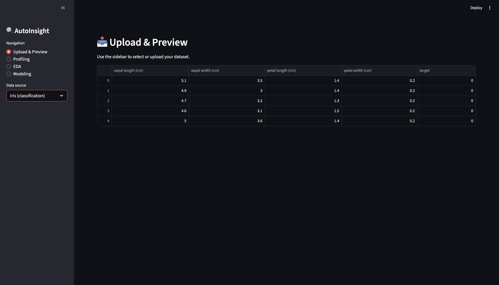
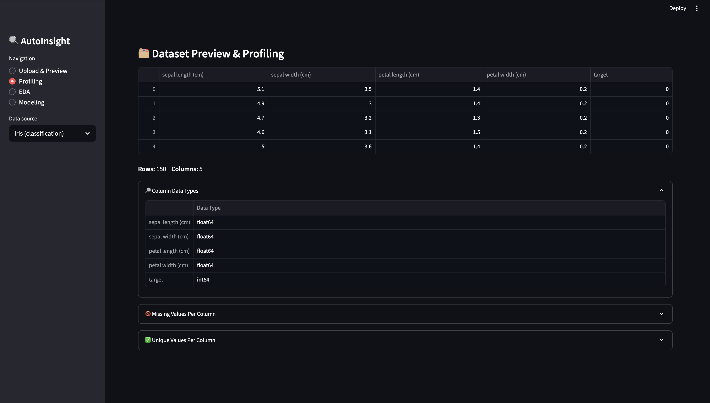
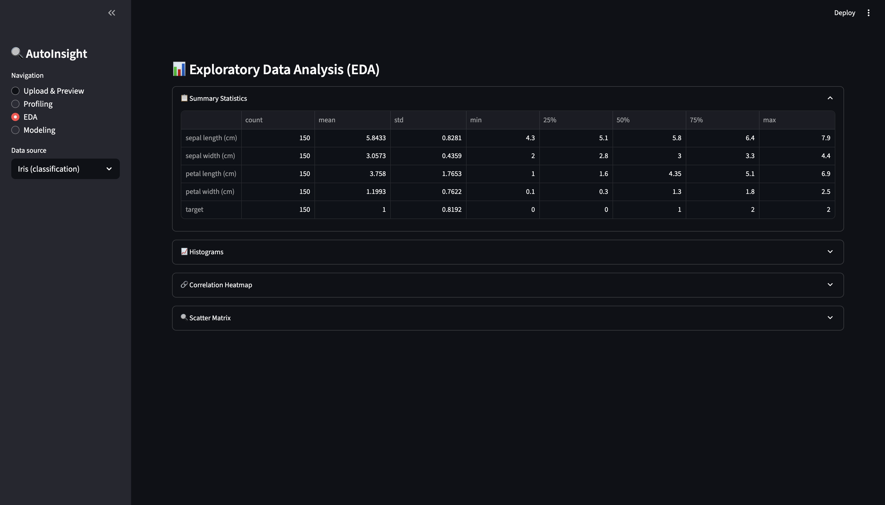
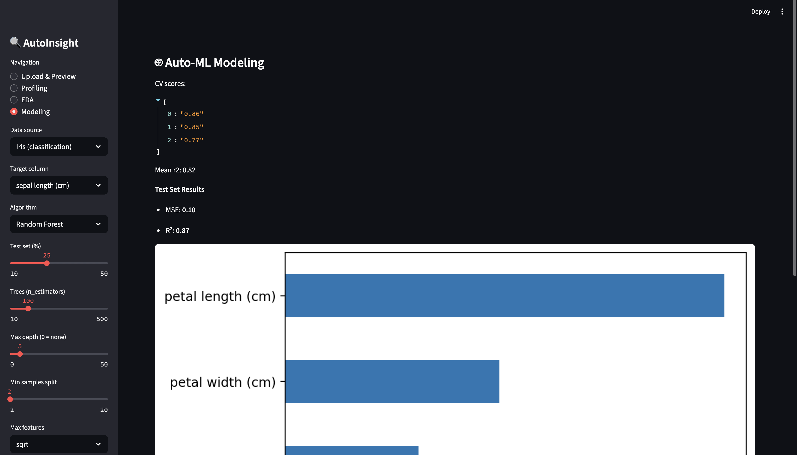

# 🚀 Data Insights App

A **Streamlit**-powered, end-to-end data exploration and Auto-ML toolkit that helps you go from raw CSV/Excel files to actionable insights—no boilerplate code required.

---

## 📖 Table of Contents

1. [What is Data Insights App?](#what-is-data-insights-app)  
2. [Key Features](#key-features)  
3. [Demo Screenshot](#demo-screenshot)  
4. [Installation](#installation)  
5. [Usage](#usage)  
6. [Project Structure](#project-structure)  
7. [Configuration & Customization](#configuration--customization)  
8. [Contributing](#contributing)  
9. [License](#license)  
10. [Author & Support](#author--support)

---

## 🧐 What is Data Insights App?

**Data Insights App** is a lightweight Streamlit application that automates:

- **Data Upload & Preview**: Drag-and-drop your CSV or Excel file.  
- **Profiling & Summary**: Generate descriptive statistics and interactive plots.  
- **Exploratory Data Analysis (EDA)**: Histograms, correlation heatmaps, scatter‐matrix—instantly.  
- **Auto-ML Modeling**: Train and evaluate classification or regression models with a single slider.  
- **Report Export**: Download a self-contained HTML report (with optional PDF export where supported).  

It’s perfect for analysts, data scientists, and anyone who wants fast, repeatable insights without writing a single line of boilerplate.

---

##  Key Features

- **Flexible Data Input**  
  - Upload any CSV or XLSX.  
  - Built-in support for popular demo datasets (Iris, Wine).  

- **One-click Profiling & EDA**  
  - Summary statistics table.  
  - Interactive histograms, correlation heatmaps, scatter plots.  

- **Auto-ML Modeling**  
  - Choose classification or regression automatically based on your target column.  
  - Tune train/test split, algorithm parameters, and cross-validation folds via sliders.  
  - View performance metrics (Accuracy, F1, MSE, R²), confusion matrix, and feature importances.

- **Beautiful Reports**  
  - Generate a standalone HTML report combining tables, plots, and model summaries.  
  - Optionally export as PDF (requires `wkhtmltopdf`).

- **Minimal Setup**  
  - Pure-Python dependencies, no Docker or heavy ML infra.  
  - Runs anywhere you can install Streamlit.

---

## 📸 Demo Screenshot

## 📸 Screenshots

**Upload & Preview**  


**Profiling**  


**EDA**  


**Modeling & Report Download**  

---

## 🛠 Installation

1. **Clone the repo**  
   ```bash
   git clone https://github.com/fahdd79/data-insights-app.git
   cd data-insights-app
2. **Create & activate a virtual environment**
    ```bash
    python3 -m venv venv
    source venv/bin/activate        # macOS/Linux
    venv\Scripts\activate.bat       # Windows
3. **Install dependencies**
    ```bash
   pip install --upgrade pip
    pip install -r requirements.txt